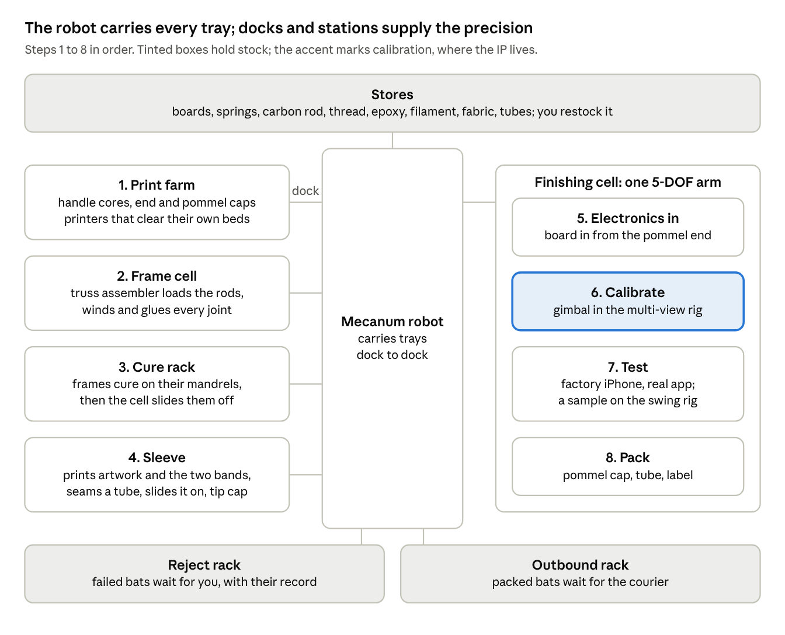

# IMU bat: automated build and calibration line

A snapshot, 1 October 2026, of the design doc of the same name; and, from 2 October, the first three milestones (M0 to M2) of its simulation plan, "IMU bat line: MuJoCo implementation plan". Where the two differ, the plan wins: it keeps a person for six manual tasks, including the sleeves, and builds every station as a gantry module. Whether the 5-DOF arm stays is still open; none of the three depends on it.

`sim/batline` is the design of an unattended line that builds, calibrates and tests the IMU bat, the study that decided the bat, the specs, the derived bat and the fast line model that the rest of the simulation builds on, the station module that every station is a copy of, and the calibration station's eight-camera rig.

    python3 sim/scripts/batline/check_all.py                # check_bat, check_line, check_gantry and check_cameras, about 14 minutes on four cores
    python3 sim/scripts/batline/demo_bat.py [--bat adult]   # the bat rendered: twelve views, one contact sheet
    python3 sim/scripts/batline/demo_station.py [--station unseen] [--window T0 T1]
                                                            # a station commissioning itself and running every op, filmed at 0.1 fps
    python3 sim/scripts/batline/demo_rig.py [--bat unseen] [--window T0 T1]
                                                            # the rig calibrating itself and measuring a bat, through its eight cameras
    cd sim && python3 -m batline.line [--demand 1000]       # the bat and the line sized for it, as text

| file | what it is |
| --- | --- |
| `README.md` | this design: the bat, the stations, transport, calibration, testing, unattended running, capacity, how it maps onto `sim/truss` and `sim/rfgyc26`, build order, risks; and what M0 to M2 found |
| `spec.py` | the facts (an AA cell's IEC envelope, the printer, the board's placeholder drawing, the knit), the product rules, the two task specs (`Bat`, `Line`), and the estimates (`Est`, `Faults`, `Person`), each naming the milestone that replaces it |
| `product.py` | the bat derived from a `Bat`: the handle's section, the board slot and its snap, the cell stack, the frame's truss, the sleeve blank, the bands' zones, the tube and the tray, every part's mass, and every fit as a margin |
| `mjcf.py` | the derived bat in MuJoCo, one body per part, with liners that measure the fits to the micrometre, and the views `demo_bat.py` renders |
| `line.py` | the line sized from a `Line` and a derived bat: station times, the floor, printers, mandrels, stores, trays, racks, the person's minutes, and which station saturates first; each station's module, and its moves timed on that module's own axes |
| `station/` | the station module (M1). `spec.py` derives a station from what its head must reach: the head, the travel, each axis' drive, preload, limits and dynamics. `mjcf.py` builds it in MuJoCo as built, play and all; `sim.py` runs it behind `hal.py`'s contract (steppers, encoders, home switches, the load cell, the camera); `vision.py` finds a fiducial's centre; `ops.py` is the executor; `commission.py` is the station measuring itself from its drawing |
| `rig/` | the calibration station's camera rig (M2). `spec.py` derives the gimbal, markers, balls, lens and standoff from the bat and the catalogue; `place.py` places the eight cameras; `mjcf.py` builds the rig as drawn or as built; `lens.py` is the camera model; `vision.py` is what the cameras see, modelled or rendered; `track.py` is association, self-calibration and tracking; `calib.py` is the bundle adjustment and the drift test; `pose.py` is the clamp's pose; `colour.py` reads the card and the bands; `judge.py` holds results against the truth, for the checks only |
| `executive/des.py` | the fast line model: a month of the line, with faults, rejects and a robot outage, in under a second |
| `imu_fusion_sim.py` | Monte Carlo of how well an IMU bat, anchored by the phone camera, knows its sweet spot at contact. numpy only: `python3 sim/batline/imu_fusion_sim.py [--quick]`. `product.py` sizes the frame against its hardest swing |
| `imu_fusion_results.md` | what that simulation found |
| `results_raw.md` | its full output |
| `line-layout.png` | the line at a glance |
| `../scripts/batline/` | `check_all.py`, `check_bat.py`, `check_line.py`, `check_gantry.py`, `check_cameras.py`, `demo_bat.py`, `demo_station.py`, `demo_rig.py` |

Every number in this folder is a model or a planning estimate, not a measurement.

## Milestone 0: the specs, the bat and the line model

Nothing in M0 is placed or sized by hand. The bat is derived from its envelope (length, handle, grip, width, depth) and the facts in `spec.py`; the line is sized from the derived bat and a `Line`. A second bat size is a second `Bat`, not a second drawing: `check_bat` derives an adult's bat the code was never developed on, and it passes unchanged.

**The kid's bat** (770 mm, handle 270, grip 32) weighs 214 g with two AA cells and 168 g as shipped, and balances at 0.26 of its length. Its frame is a 48 mm triangle of 2 mm chords and 1 mm diagonals with 30 joints, 14 g, inside the truss cell's gantry reach (891 x 216 mm of 1,400 x 300). Under the hardest swing in the accuracy study it takes 4.2 N m at the shoulder, with a buckling margin of 5.13 against the truss cell's rule of 5. All 33 fits pass. The adult's bat (860 mm, handle 300, grip 34) weighs 255 g, gets 3 mm chords and a buckling margin of 10.

**What M0 found that needs a decision or a later milestone:**

1. **The printed handle bends.** Under the rated swing the sweet spot moves 0.4 mm with the blade's bend but about 3.8 mm with the handle's (an estimate, for PETG at 2 GPa), against the 0.5 mm of lever-arm error the accuracy study assumed. M5 (`check_frame`) has to settle it; a stiffer handle may be needed.
2. **The bands have no room for the knit's stretch.** Each band's zone (5 mm either way) is used up by printing and placement scatter, and band 1 moves about 1 mm for every 0.01 of error in how much the knit narrows when it is stretched. M7's sleeve rig has to measure that, or the zone has to grow.
3. **The core only fits a 256 mm printer bed on the diagonal**, one a plate, so 13 of the 16 printers at 300 a month print cores.
4. **Cutting rods by hand is the person's biggest task**: about 5 of the 11.5 minutes a bat the event model measures (the sleeves take nearly 4). With rods bought cut to length, or cut by a machine at station 1 (`Line(rods_by_hand=False)`), the event model measures about 7.
5. **A tray of four bats is 816 x 296 mm and has to span the 700 mm between a dock's rails**, so bats lie along the aisle and docks sit 0.82 m apart. Each station's gantry is then longer than the truss cell's (0.8 to 3.3 m along the aisle, against 1.4 m), and the aisle is about 26 m long at 300 a month (41 m at 1,000).
6. **The 3-day promise has no slack for a bat that fails after its sleeve is fitted**: the new sleeve waits for the next visit. In ten simulated months that made one order late, by 0.9 days.

**The line at 300 a month** (16 hours a day, a visit each morning, a restock each week): station 1, the frame, takes 28 minutes a bat (23 by the truss cell's own planner, 4.5 of moves) and is the only busy station, at 31%; the other four are under 5% and the robot 8%. It needs 16 printers, 16 mandrels, a stock of 25 frames, and 13 bat, 8 tube, 8 stretcher, 4 mandrel and 11 parts trays. Ten simulated months with station and robot faults and an 8-hour robot outage shipped every order inside the promise apart from the one above, with no store running dry and no rack overflowing.

**At 1,000 a month station 1 saturates first**: it can build about 970 a month. The robot comes next by the plan's estimate (about 3,800), though the event model measures it 17% busier than that estimate at 300; then the sleeve station (about 6,700). At 1,000 the event model's frame stock runs dry every month.

**The checks.** `check_bat` (188 checks) holds every fit, overlap, mass and band on both bats, then builds both in MuJoCo and measures the fits against liners and the masses against the derivation. It also derives 13 bats that must fail; nine of them have one spec pushed 0.05 mm (or 0.05 g) past the room their fit reports, and must fail by exactly that much, which shows each margin is the real room. `check_line` (73 checks) tests the sizing maths against a direct sum and a simulation of the print farm, every fit of the plan, ten months at 300, and three lines that must fail: one asked for more than station 1 can build, one restocked short and one with too few stretchers.

**What is still an estimate:** every station's work inside a job (`spec.Est`), every fault and reject rate (`spec.Faults`), the person's minutes (`spec.Person`), the board's drawing, the knit, the robot's speed, and the dock. Each names the milestone that replaces it.

## Milestone 1: the station module

Every station is one module, copied: X, Y and Z on MGN12 rails, a NEMA 17 with an encoder on each axis, a head carrying that station's tools on a 3-axis load cell, and one camera looking down. Nothing about a copy is typed. `station/spec.py` takes what a station's head must reach (the docks, fixture and test pieces `line.py` laid out, and which tool works on each) and derives the head, the travel, each axis' drive, preload and speed limits, and the dynamics MuJoCo builds from. `check_gantry` then runs two copies in MuJoCo: the kid's electronics station (X 1,643 mm, four tools), which the module was developed on, and the adult's pack station (X 2,728 mm, five tools, two of them never carried before), which it had never seen. Both pass unchanged: 80 checks, about 5 minutes on four cores.

**The drives.** The plan's 12 mm ball screw whips before it reaches the rated 60 mm/s on any X longer than about 1.15 m, and a 20 mm screw past about 1.6 m. Four of the five stations need 1.6 to 3.6 m of X, so their X is rack and pinion (module 1, a 20-tooth pinion through a 16:1 planetary, 0.0196 mm a step), driven from both sides as a bridge is; chan chose this on 2026-10-02. The calibration station's X (0.8 to 0.9 m) and every Y and Z keep SFU1204 screws. A must-fail builds the adult's pack station on screws alone and shows it missing its rated speed and acceleration. Every axis reaches the rated speeds, so the line's times from M0 do not move: station 1 still takes 28 minutes a bat.

**Repeatability.** Each axis on both stations returns to the same place within 0.0001 mm, from both sides, at both ends and the middle of its travel, against the brief's 0.05 mm. That is the model's floor, not a prediction: the model has no rail wear and no drift during a run. What it shows is that nothing in the design loses repeatability once the next finding is in.

**Every axis needs a preload, not a one-way approach.** A rack's play (15 arcmin at the gearbox plus 0.05 mm at the mesh, 0.094 mm in all) is about twice the module's repeatability. Ending every move travelling the same way, as CNC machines do, did nothing in the rig: the rotor rings at the end of a move and the carriage stops anywhere in its play. What works is a constant force pulling each carriage toward home (a constant-force spring; on Z, a counterweight that overbalances), larger than anything that could pull it off the loaded flank: about 21 to 23 N on X, 9 to 11 N on Y and 12 to 14 N on Z. With it, every axis holds its place within 0.0008 mm under the largest force a process may put on it (11.2 to 11.6 N on X). Without it, X is pushed across its whole 0.094 mm of play; that is the must-fail. Plain moves without the preload still repeat to 0.032 to 0.038 mm, which is why a repeatability test alone never found this. The rule that follows: a process force must push the way the preload pulls, or stay under it.

**Lost steps and homing.** A jam mid-move (a stop in the carriage's path) is caught by the encoder, 5,236 and 8,700 steps short, and the move fails; homing again from the middle of the travel puts X back within 0.0012 mm. Homing seeks the switch at a quarter of full speed from wherever the axis is, backs off, and creeps onto it at 1 mm/s, the speed the switch's 0.005 mm repeat is quoted at.

**Commissioning: the station measures itself from its drawing.** Each build is drawn with its own errors (tools, camera offset and tilt, docks, fixture, home switches; `spec.Build`). The station homes, measures its camera's scale, turn and tilt using its own steps as the ruler, finds each dock and the fixture by their fiducials, and measures every tool against a reference pin by touching it from four sides and on top through the load cell. The kid's electronics station takes 333 s of station time for four tools; the adult's pack station takes 475 s for five. After that, every tool sent over the pin, and over the four corners of the farthest region it works on, lands within 0.035 mm on the kid's station (0.021 rms) and 0.030 mm on the adult's (0.023 rms), and at the height asked for within 0.020 mm. Sent by the drawing alone, the same tools miss by 1.5 and 0.8 mm.

**Accuracy is set by the camera, and the check says so.** The bound is not a millimetre figure picked to pass: each target must land within 4 sigmas of what the camera can know there. One look is good to about 0.0096 mm (0.07 px at the look range), growing to about twice that at a corner nobody looked at. The worst target was at 2.6 sigma. With the camera's noise switched off, commissioning lands within 0.008 mm rms, so the camera, not the mechanics, is the limit.

**What M1 found:**

1. **Two fiducials a region are not enough.** The head's steps are the ruler, and a rack or screw a few kelvin warmer than when it was cut is a longer ruler, each axis by its own amount. With two fiducials and a rigid fit, the adult's 1.7 m fixture was 0.14 mm out at each end; a fit that also took a scale still left 0.08 mm at the corner nobody looked at. Each region now carries three fiducials in an L, as a circuit board panel does, and an affine fit takes up each axis' scale and their squareness. Commissioning records the scale it found.
2. **The camera's centroid error is measured, not assumed.** The rendered frames put a fiducial's centre within 0.016 px rms of the model camera on the kid's station and 0.069 px on the adult's, a bias common to its flat discs that is not the light's fall-off, the headlight's reflection or the renderer's smoothing. The larger, 0.07 px, is now `HeadCam.CENTROID_PX`, and `check_gantry` re-measures it every run. It still has to be measured on the real camera.
3. **The camera must centre over what it measures.** The 20 mm reference pin seen off-centre is found 12 px away from where it is, by parallax; `look()` centres first.
4. **Unexplained:** the press reads the 2.0 N/mm test plunger 2.7% low (1.945 and 1.948 N/mm, inside the 10% it is held to). The load cell's own spring accounts for only 0.4% of that.
5. **Two MuJoCo modelling lessons**, kept so they are not relearned. A force that pulls from the frame (the preload, a disturbance) has to be applied to both the drive and the carriage, so the motor carries it; applied between them, it hid lost steps. And friction on a light, spinning joint did not stop the test nut spinning off its stud when the collet spun up, so a weld stands in for the self-locking thread and is released while the collet holds the nut.

**The checks.** `check_gantry` (80 checks) first holds every station of both bats to the module's rules in arithmetic: all ten meet their 20 to 22 rules, and each travel takes in every region and fiducial wherever 200 drawn builds put them, with 0.76 to 1.43 mm to spare. Then, in MuJoCo on each of the two stations, it checks repeatability, holding under process forces, lost steps and re-homing, commissioning and accuracy against the camera's bound, every op on the module's test pieces, and the camera's centroid against rendered frames. The ops are: each pick tool (gripper, vacuum cup, magnet, collet) takes a steel token and sets it back upright inside its nest's 0.25 mm clearance; the press reads the plunger's rate; the spindle runs a nut 8.8 turns down its stud until it seats; and the pogo block closes all five pins on its pad. Four must-fails show each finding is real: screws only on a long X, X without its preload, a tool sent by the drawing, and the pin seen off-centre. `check_line` now also holds every station's module to its rules when it sizes the line (176 checks, up from 73). `demo_station.py` films a station doing all of this at 0.1 fps, from the aisle and from a camera riding Z beside the tools; the frames of both stations were read for this milestone, and at 1 fps through the screw op, where the nut is seen to run down its stud and seat.

**What is still an estimate:** every hardware fact marked [VERIFY] in `spec.py` (the motor's pull-out curve, the rack and gearbox, the rails' drag and damping, the load cell, the camera, every tool), the build errors in `spec.Build`, and the test pieces. The ops ran on test pieces, not on bat parts; those come with the stations, M5 to M8.

## Milestone 2: the camera rig

Station 4 is the station module plus a two-axis gimbal that turns the bat through every orientation, and eight cameras round it that measure the clamp's pose in every frame and read the bands' colours. Nothing in it is placed by hand. `rig/spec.py` derives the gimbal, its markers, the ball size, the lens and how far the cameras stand off from the bat and the catalogue; `rig/place.py` places the cameras; the rig then calibrates itself from a certified bar. `check_cameras` runs all of it on the kid's bat, which it was developed on, and on the adult's, which it never saw, with two implementations of the cameras: a fast model, and frames rendered in MuJoCo and warped through each camera's true lens. Both bats pass: 85 checks, about 9 to 10 minutes on four cores.

**The rig.** For the kid's bat: 19 mm retroreflective balls on M3 stems, a 3.6 mm M12 lens, the cameras 1.35 m from the gimbal's centre (1.48 m for the adult's), eight markers on the inner ring and eight balls on the bar. The gimbal sweeps a ball 0.99 m across, its centre 0.50 m up. Station 4 needs 2.78 x 2.53 m of floor; its gantry homes above the sweep, so Z has 0.98 m of travel and the frame's rails sit 2.24 m up, clear of it. A bat takes 276 s there.

**The placement rule had to change.** The plan asked for every marker on the clamp to be seen by three cameras at every pose. No set of eight cameras does that: at some poses the ring hides its own balls from too many directions. The rule now is that with any one camera lost (blocked, knocked, dead), every pose still rests on at least three markers each seen by three cameras, and the pose is fixed within the rig's share of the calibration budget (a quarter of the 0.2 degree mounting and 0.5 mm lever-arm targets, 1 sigma). A view counts only if the tracker would use it: the ball whole on the sensor, nothing within a guard band of its outline, its stem side-on enough to correct, and its image clear of every other ball's. The solver searches 207 allowed camera positions against 288 gimbal poses and is judged on 576 poses it never saw. With any one camera lost, both bats' rigs keep at least 4 such markers, with the pose fixed to 0.0057 degrees and 0.054 mm (kid) and 0.0060 degrees and 0.059 mm (adult). The best seven cameras fail the rule on both bats (2 markers), so the eighth camera is needed. Eight cameras spread evenly at the gimbal's height also meet the rule, with one marker less to spare, so the solver buys margin here, not feasibility.

**Self-calibration finds the planted lens errors.** Each build is drawn with its own errors: every camera's place (5 mm), tilt (1 degree), focal length, principal point (15 px) and lens curve, the gimbal's axes and encoder zeros, the markers, the stems' pull, and each sensor's colour response. The gimbal turns the certified bar through an 8 x 8 grid of poses; the rig associates blobs to balls, bundle-adjusts every camera and marker, and repeats until the matches settle. Afterwards every calibrated camera puts every ball within 0.008 to 0.015 px rms of where the camera as built does with the model cameras (0.045 px at worst), and 0.009 to 0.019 px from rendered frames, against the 0.07 px centroid budget. Every lens parameter and marker lies within 4 sigmas of its own stated sigma.

**The clamp's pose, on poses no calibration saw**, is good to 0.0058 degrees and 0.018 mm per axis with the model cameras on the kid's bat (0.0026 and 0.021 on the adult's), and to 0.0029 degrees and 0.006 mm from rendered frames (0.0019 and 0.006). The budget is 0.05 degrees and 0.125 mm, so the margin is at least 6 times. The gimbal's encoders alone are 0.24 to 0.30 degrees and 1.1 to 1.8 mm off, which is why the cameras are needed.

**The shift-start check** looks at the ring's markers at 16 poses and tests the residuals against the noise, and each camera's share of the balls it should have matched and did not. It passes the rig as calibrated. It catches a camera knocked by 0.05 degrees (the rig's whole rotation share), whichever of the eight it is, and names it; and it catches and names a camera gone dark, or knocked 1.5 degrees, so far that nothing it sees can be matched.

**Colour.** A card of four printed patches (white, red, green, blue) on the clamp gives each camera's colour response; each band is then read against the sleeve beside it on the same flat face, which cancels the light and the angle. Every colour written reads back within 0.45 dE (CIE76) in the model and 0.35 dE in rendered frames, against the 2.3 dE limit: the design's colours, the two bands swapped, both bands the sleeve's white, and one band printed 4.6 dE off. The line passes the design's bands and refuses the other three.

**What M2 found:**

1. **The stems pull the centroids.** A ball's stem, seen from its own side, hides a strip of the ball and drags the centroid away from it, by up to about 0.3 px in the rendered frames, several times the noise. Placing cameras to avoid that cost about a third of all views and broke the placement rule. Instead the pull is corrected: its shape follows from the geometry, and its scale is one number for the rig, which self-calibration solves along with everything else (to about 0.02). Rendered frames pull 1.24 to 1.33 times the simple area model; after the correction, what is left is 0.024 to 0.032 px rms, against 0.17 to 0.18 px uncorrected. Left uncorrected, the shift-start check refuses a healthy rig.
2. **The placement must count only views the tracker will use.** At first about one view in ten that it counted was one the tracker refuses: a ball whose image touches another ball's, or with something just outside its outline. Judged by the tracker's own test, that placement left a pose with only 2 markers. The placement now uses the same test, `check_cameras` holds it to counting nothing the tracker refuses, and re-placed under it both rigs keep 4.
3. **A camera that sees nothing passes a residual test.** The shift-start check tested only the residuals of what it matched, so a camera gone dark, or knocked far enough that nothing matched, left no evidence and passed. It now also counts the balls each camera should have matched and did not, against all the cameras together, so no failure rate has to be assumed.
4. **The card has to be under the clamp too.** The gimbal turns a flank's normal only about its outer axis, so no pose faces a flank down the aisle, and two of the kid's cameras never saw the card. The card now also has a row on the clamp's underside, which can face any direction.
5. **The card buys margin, not a pass.** Without it the bands read 1.1 to 2.2 dE off: inside 2.3, with almost no room for a real sensor's drift.
6. **The supplier's lens curve alone already holds the pose budget.** Holding the lens curve at the catalogue value instead of solving it leaves the cameras 0.11 to 0.45 px off, 1.6 to 6.5 times the centroid budget, yet the pose stays within 0.008 degrees and 0.07 mm. Solving the lens is what lets the shift-start check work at the noise, not what holds the pose.
7. **The marker balls hide card patches.** A visibility test that ignored the balls let one camera read a patch half covered by a marker, which put that camera's colour response 10% out. Colour visibility now counts everything a ray can hit.
8. **The stated noise must be the budget, not the scatter.** Rendered centroids scatter by 0.02 px, but the solution's own sigmas built on that understated the markers' and poses' errors by up to 2.7 times, because the residuals cannot see what the solution absorbs. Calibration and tracking now state their covariances at the 0.07 px the rig is held to, which `check_cameras` measures on rendered frames every run.
9. **The station gripper cannot take the bat by its handle.** `Gripper2` opens 20 mm and the grip is 32 to 34 mm. M3, which loads the bat into the clamp, needs a wider gripper or a different hold.
10. **The line model now uses common random numbers.** M2's larger station 4 changed the floor, which re-dealt the event model's random month and moved a `check_line` result that had nothing to do with it. Each source of chance (orders, each resource's faults, each station's rejects) now has its own random stream, so a change elsewhere deals the same month.

**The checks.** `check_cameras` (85 checks): the placement on both bats, judged on held-out poses, with the best-seven must-fail and the tracker's own test; in arithmetic, the rig, its site and station 4's module against their rules, and a scan that no procedure reads the scene's truth; then, per bat, self-calibration, the held-out pose, the shift-start check and colour with the model cameras, and the centroids, self-calibration and pose from rendered frames, plus colour from rendered frames on the kid's. Its must-fails are: the supplier's lens curve held, the encoders alone, the best seven cameras, the stems' pull left uncorrected (both in the centroids and in the shift-start check), and three wrong band prints. `demo_rig.py` films the bar's calibration sweep and the bat's poses through the eight cameras at 0.1 fps, with the drawing's and then the calibration's predicted ball positions drawn on each view; the kid's sheet was read for this milestone.

**What is still an estimate:** every [VERIFY] fact about the cameras, lenses, ring lights, markers, gimbal and card, the rig's build errors (`spec.RigBuild`), the scale of the stems' pull on a real ball, and the colour model (a matte surface lit from the lens). The IMU's own calibration from these poses is M3.

## Summary

One unattended line can build, calibrate and test the bat at 300 a month and stretch to 1,000. It uses the machines you already have: the truss assembler, the XYZ gantry, the 5-DOF arm, the mecanum robot and the multi-view camera rig. Only the electronics board is bought in, and customers fit their own AA batteries, so the line never handles a cell.

Running 16 hours a day, 300 a month means one finished bat every 96 minutes. At 1,000 a month it is one every 29 minutes. Speed is not the hard part; running for hours with nobody there is.

Five rules shape everything below:

- **Design the bat for the robot.** Every part goes in with one straight move against a datum. No cables, separate screws, batteries or loose fabric.
- **Measure, don't place precisely.** The camera rig measures where each part ended up, and those measurements become the bat's calibration, stored on the bat.
- **Coarse by robot, fine by dock.** The mecanum robot only brings a tray near a station. A kinematic dock sets its exact position.
- **Every bat is calibrated and tested.** A sample is also swung at full speed against a stereo reference.
- **Nothing waits for a person.** A failed bat goes to a reject rack, the line keeps running, and you get a message.

All times and costs here are planning estimates, not measurements.

## The bat, designed for the robot

The bat is six parts, and each goes in with one straight move against a datum. Only the board is bought.

| Part | Made by | Goes in by |
| --- | --- | --- |
| Handle core: battery tube, board slot, datum faces | printed in-house (my default) | gantry places it in the frame jig |
| Blade frame | truss assembler | built onto the core |
| Electronics board | bought, ready-assembled | slides into the slot and snaps against two datum faces |
| Battery contacts | bought springs | pressed into the core |
| Printed sleeve with two tracking bands | printed in-house | pushed off a mandrel onto the bat |
| End caps | printed in-house | pressed on along the bat's axis |

**The board** should carry:

- **An nRF52840-class microcontroller.** It runs straight from 2 AA cells (1.7 to 3.6 V) with no boost converter. Bluetooth streaming draws a few milliamps, so 2 alkaline AA should last on the order of 200 hours of play (estimate).
- **A ±32 g / ±4000 dps IMU**, for example the TDK ICM-42686-P (check the datasheet). The simulation showed ±2000 dps saturating on hard swings.
- **Test pads on one face for pogo pins:** power, programming and serial. The line powers, flashes and calibrates the bat without a battery.
- **A hold-up capacitor and brownout-safe firmware**, because AA cells can bounce off their contacts in a hard swing.
- **Wake on motion from the IMU**, so there is no power switch to fit.

**Three rules keep the calibration valid for the life of the bat:**

- The board seats in the fixed core, never in the removable battery cap. Otherwise every battery change would move the calibrated IMU.
- The customer fits 2 AA in line through a screw-on pommel cap. The line never touches a battery.
- The sleeve's two tracking bands sit in reserved zones of fixed colour, about 30 mm wide and 0.45 m apart. Everything else on the sleeve is free artwork.

## The line at a glance

Every station has one dock. The robot sets a tray on it and later takes it away; all precise handling happens inside the station.

Steps 1 to 3 make identical frames to stock. An order enters at step 4 with its artwork, and the bought board only goes in at step 5, so boards are never tied up in unsold bats. You restock the stores and empty the two racks on your own schedule; nothing on the line waits for you.

## The stations

Each station reads the tray's tag and each bat's serial, does one job, checks its own work, and adds what it measured to the bat's record.

### 1. Print farm

Prints the handle cores, the blade-tip end caps and the pommel caps. Unattended printing needs printers that clear their own beds, such as belt printers or printers with an automatic plate changer, so finished parts drop into a tray at the dock. A camera at the dock checks the count, and that each core's board slot and battery bay are clear.

### 2. Frame cell

This is the truss assembler you already have. Its XYZ gantry loads carbon rods from magazines into a fixture on a collapsible mandrel, the C-ring winds Kevlar thread round each joint, and the dispenser puts epoxy on each band. For the bat, the handle core sits on the end of the mandrel, so the chords seat into its sockets and the frame is built onto it.

The bat's frame is a new task spec, and the existing code computes the fixture, the winding clearances and the cycle time from it. The cell's camera finds each joint before winding, and the inspector judges the finished frame from the ring's counted turns and where each rod was measured.

### 3. Cure rack

Wet frames cure on their mandrels in a rack, so the cell can start the next frame at once. When a frame has cured, the robot brings its mandrel back to the cell. The cell pulls the draw rod to collapse the mandrel (the one-pull release already designed in `collapse.py`), slides the frame off and reuses the mandrel. Finished frames wait on the rack as stock until an order needs them.

The number of mandrels follows from the cure time and the takt, so it is computed once the epoxy is chosen.

### 4. Sleeve

The one station that handles fabric, and the riskiest. It prints the customer's artwork, with the two tracking bands in their reserved zones, onto polyester knit by dye sublimation. A laser cuts the panel, which also seals the polyester's edges, and an ultrasonic head seams it into a tube; the cutter and the seam head ride an XYZ gantry.

A mandrel stretches the tube, a linear axis pushes the frame into it along the bat's axis, and the mandrel withdraws so the sleeve closes onto the frame. A press fits the blade-tip end cap, which clamps the sleeve's end. A camera checks the bands' colours and order against the artwork file; their exact positions are measured at step 6.

### 5 to 8. Finishing cell

The cell is built around the 5-DOF arm, which stays in this cell. The robot docks one tray of sleeved bats, and the arm takes each bat through four steps and puts it, packed, on an outbound tray.

- **5. Electronics in.** The arm slides the board into its own slot beside the battery bay, from the pommel end, until it snaps against its datum faces, then presses the contact spring in. A pogo block touches the board's pads at the pommel end to power it, flash the firmware, write the serial number and run a self-test: the IMU answers and reads gravity within its datasheet tolerance, and Bluetooth advertises. The board goes in this late so it never sees the epoxy's cure, and only ever into a bat that has an order.
- **6. Calibrate.** The arm loads the bat into a 2-axis gimbal inside the multi-view camera rig. The calibration section below covers what it measures.
- **7. Test.** A factory iPhone running the real app pairs with the bat and watches it at playing distance while the arm moves it slowly. A sample of bats also goes to an enclosed swing rig. The testing section below has the detail.
- **8. Pack.** The arm screws on the empty pommel cap, slides the bat into a cardboard tube with a quick-start card, caps the tube and applies a label with the serial and order number. A tube makes packing one axial move, which folding a box is not. A camera reads the label back against the order.

While the gimbal runs a calibration, the arm packs the previous bat and fits the next board, so one arm keeps up with the line.

## Moving bats between stations

- **Trays, never loose bats.** The robot carries trays. A tray holds several bats in V-cradles (four is my default) and carries a tag the stations read. Part totes, mandrels and packed tubes ride in trays of the same footprint, so one robot and one kind of dock move everything.
- **Coarse by robot, fine by dock.** Every dock is the same: two rails the robot drives between, carrying three balls. Each tray has three matching V-grooves underneath with chamfered lead-ins, a kinematic coupling. The robot only has to arrive within the lead-ins' capture range. When it lowers its lift, the tray drops onto the balls and lands in the same place every time, to well under a millimetre. The station's camera reads the tray's tag to confirm what arrived.
- **Where to stop is computed, never taught.** The stopping pose comes from the solver the competition robot already uses (`station.stand_for`), which ranks poses by their margin in millimetres against the dock's capture range. Moving a station is an edit to the floor map, not a re-teach.
- **Navigation.** Paths come from `nav.plan` on a costmap of the room built from the floor plan. The robot localises from wheel odometry and fiducial markers on the floor or walls, and the dock's camera corrects it over the last metre. Mecanum wheels let it slide sideways into a dock instead of shuffling.
- **One robot carries the volume.** Each tray makes about six to eight trips between print farm and outbound, shared by the bats on it, so a bat costs about two robot moves: a few minutes of robot time against a takt of 29 to 96 minutes (estimate).
- **But one robot is a single point of failure.** Every station's input and output buffers are sized to keep it working through a robot outage of the length you choose. A second robot then buys redundancy rather than throughput, and the fleet executive already in the code (`fleet.py`) handles two robots sharing narrow aisles.
- **Its own battery.** The robot charges at a dock between jobs, and the scheduler plans around its charge like any other resource. A LiFePO4 pack keeps the fire risk low; it is the least fire-prone common lithium chemistry.

## Calibration: the camera rig is the reference

The calibration cell needs neither a precise clamp nor a precise gimbal. The multi-view cameras measure where the bat actually is, at every moment, in 6-DOF, and the calibration fits the IMU's errors against that measured truth.

**What happens to each bat** takes a few minutes, mostly gimbal motion (estimate):

1. **Power and data.** The pogo block on the gimbal's clamp powers the board through a slip ring. The bat streams over Bluetooth, the link it will use in play.
2. **Geometry.** The cameras measure the bat's axis, its length, the sweet spot, and the two bands' positions and colours. These define the bat frame the game uses.
3. **Accelerometer.** The gimbal holds the bat still in a set of orientations, where gravity is the only input. The cameras measure each orientation, and a least-squares fit gives each axis's bias, scale and cross-axis error (the standard multi-position method). The same still periods give the gyro's bias and its sensitivity to gravity.
4. **Gyroscope.** The gimbal spins the bat through whole turns about each axis. The angle turned is known exactly from the counted turns, which the cameras confirm, so the fit gives each gyro axis's scale and cross-axis error.
5. **Mounting.** A spin about the bat's own long axis shows which direction the IMU takes as "along the bat", so the board's angle in the bat is measured, not assumed.
6. **Lever arm.** A spin with the IMU off the spin axis produces a centripetal acceleration that grows with its distance from the axis. With the cameras' geometry, that places the IMU relative to the sweet spot and the bands.
7. **Timing.** The offset between the bat's clock and the cameras' clock is estimated from the motion itself, by matching the gyro's rate to the rate the cameras see, as open-source camera-IMU calibrators such as Kalibr do.

**The target.** The simulation's 6 to 12 mm result assumed these residuals after calibration: gyro bias 0.02 dps, scale and cross-axis 0.05 %, accelerometer bias 2 mg, mounting 0.2°, lever arm 0.5 mm. Before any hardware exists, a check plants known errors in a simulated IMU, runs the gimbal plan through a camera model, and requires the fit to recover them to these values. Bias also drifts with temperature and each power-up, so the game keeps re-learning it in play; the factory's job is the terms that drift little.

**Keeping the rig honest.** Each shift starts with a golden bat, a reference bat measured many times. If its numbers move by more than the rig's own measured repeatability, the cell stops calibrating and messages you, rather than shipping bats calibrated by a drifting rig. The cameras are recalibrated against a target on the same trigger.

**Stored on the bat**, in its flash and in the factory database under its serial:

- serial number, firmware version, calibration date and temperature
- gyro and accelerometer bias, scale and cross-axis terms, and the gyro's gravity sensitivity
- the IMU's rotation and position in the bat frame
- the bat's geometry: axis, length, sweet spot, and the two bands' positions and colours
- a checksum

The game reads this record over Bluetooth when the bat pairs. The factory copy lets a corrupted record be restored, and lets a returned bat be compared with its day of manufacture.

## Testing: every bat slowly, a sample at full speed

**Every bat** is tested in the finishing cell straight after calibration:

- **Pairing.** A factory iPhone running the real app pairs with the bat and reads its calibration back.
- **Bands at playing distance.** The iPhone must find both bands from where a player's phone would stand. A mirror can fold that distance into the cell.
- **A slow fused swing.** The arm moves the bat along a slow path while the app fuses the IMU with its camera. The multi-view rig measures the same motion, and the fused sweet spot must agree with it within the product's accuracy budget for that speed. The limit comes from the budget, never from a number picked to pass.
- **Current draw**, asleep and streaming, measured through the pogo block. This catches a board that would flatten its cells early.

**A sample at full speed.** The arm cannot swing a bat at 20 to 30 m/s, so an enclosed swing rig beside the cell does. A motor swings the bat through a full arc while your Pi stereo rig, at high frame rate and short exposure, measures the true sweet spot to compare with the bat's own estimate.

During the swing the bat runs from a dummy pack of two AA-sized supercapacitors, weighted like two AA cells, which the rig charges. So the line still handles no batteries, and the swing still tests the contacts for bounce.

The first bat of each batch is sampled. After that, the sampling rate is set from how much bats turn out to differ, once a few hundred have been measured. Every result goes into the bat's record.

## Running with nobody there

- **One record per bat.** Each bat's record moves through fixed states: core printed, frame wound, cured, sleeved, electronics in, calibrated, tested, packed, then shipped or rejected. Every station writes what it measured. If the controller restarts, it rebuilds the line's state from the records and the tray tags.
- **Build to stock, finish to order.** Frames are made ahead whenever the frame cell is free. An order starts at the sleeve with its artwork, so it waits only for steps 4 to 8.
- **Who moves what next.** Stations, docks, mandrels and the robot are resources, and transport jobs are allocated by auction over one shared task list, as the repo's rules require. With one robot this reduces to a priority queue, and it extends to two unchanged. Travel times come from the path planner with a measured pace factor, never from a table.
- **Buffers instead of babysitting.** Buffer sizes are computed from the stations' cycle times and the longest outage you want the line to ride through, not picked. The stores hold enough for the time between your visits, and you get a reorder message when stock falls to a supplier's lead time.
- **Nothing hangs.** Every action has a timeout, the rule the competition robot's missions already follow. A step retries once only where a retry is safe, such as re-docking a tray. Otherwise the bat goes to the reject rack with its record, the station runs its own self-check, you get a phone notification, and the line carries on.
- **Stop only what threatens many bats.** A station that fails its self-check takes itself offline. A golden-bat failure stops calibration. A safety fault stops everything.
- **Safe when empty.** No cells are on the line. The printers, and the cure rack if it is heated, have independent thermal cut-outs, and a smoke detector cuts the power and messages you.
- **Visible from your phone.** The records and a camera view of the line are on your phone.

What you still do: restock the stores, empty the outbound and reject racks, and maintain the machines, on your own schedule.

## Capacity and cycle time

At 16 hours a day, 300 bats a month is one every 96 minutes, and 1,000 a month is one every 29 minutes. The times below are planning estimates unless marked as coming from the repo, and each is replaced by a measurement as its station is built.

| Station | Time per bat | At 300 a month | At 1,000 a month |
| --- | --- | --- | --- |
| Print farm | about 2 hours of printing, if a core and its caps print together (estimate) | 2 printers | 5 printers |
| Frame cell | not yet planned for a bat; the 300 mm test truss simulates at 9.4 min and the 1 m truss plans at 24.1 min (repo) | 1 cell | 1 cell, if the bat frame plans under 29 min |
| Cure rack | off the cell; set by the epoxy | mandrels = cure time ÷ takt, plus one | same rule |
| Sleeve | a few minutes of fitting; printing runs in batches (estimate) | 1 | 1 |
| Finishing cell | 5 to 10 min, mostly gimbal time (estimate) | 1 arm | 1 arm |
| Robot | about 2 moves per bat (estimate) | 1 | 1, plus 1 for redundancy |

Printers needed = printing hours per bat ÷ takt in hours, rounded up.

**What it means.** At 300 a month every station has slack, which leaves room for retries, maintenance and rejects. At 1,000 a month the printers and the frame cell set the pace, and both scale by adding a machine rather than by redesigning. Before anything is built, the whole line runs as a fast simulation with no physics, at both volumes and with robot outages and rejects injected, to size the buffers.

## How it maps onto the existing code

The line becomes a third fixture for the same codebase, beside the competition robot (`sim/rfgyc26`) and the truss cell (`sim/truss`). Most of the hard parts already exist in a general form. My default is a new package, `sim/batline`, with its own spec, hardware layer, model and check suite.

| Part of the line | Reuses | New work |
| --- | --- | --- |
| Frame cell | all of `sim/truss`: `spec`, `structure`, `fixture`, `collapse`, `approach`, `schedule`, `motion`, `process`, `hal`, `cell`, `vision`, `inspector` | the bat as a truss spec, swing loads in place of camera loads, the handle core as a fixture part |
| Docking | `station.stand_for` and `station.reachable` | the dock as the region, the lift as the effector, robot plus tray as the footprint |
| Robot transport | `nav` (its costmap already takes a size), `world`, `trajectory`, `estimator` | the workshop's floor map, and mecanum kinematics, since both competition robots are differential drive |
| A second robot | `fleet`: reservations, live avoidance, priority | aisles as the shared resources |
| Scheduling | the pattern of `planner` (an exact solver over a small task set) and the auction rule in `CLAUDE.md` | a flow-shop scheduler with buffers, with travel times from `nav.plan` and a measured pace factor |
| Calibration cell | the IMU error model from the fusion simulation (`imu_fusion_sim.py`, in this folder) as the simulated bat, and the two-implementation camera pattern of `truss/vision.py` | the gimbal, the calibration fit, the stored record |
| Test verdicts | `truss/inspector` and `rfgyc26/referee`: a pure function of what was measured against an acceptance table | the bat's acceptance table, from the accuracy budget |
| Hardware layer | both `hal.py` contracts: one file, a simulator backend and a machine backend, raise rather than lie | gimbal, pogo link, camera rig, arm, robot lift, printers |
| Review | `truss/filmstrip.py` contact sheets | none |

**New checks, each one a rig that can fail:**

- `check_calibration` plants known errors in a simulated IMU, runs the gimbal plan through the camera model, and requires the fit to recover them within the calibrated budget.
- `check_dock` compares the robot's arrival error, from the estimator, with the dock's capture range, as a margin in millimetres.
- `check_tray` measures the kinematic coupling's repeatability in MuJoCo, a mechanism question where physics earns its cost.
- `check_line` runs the whole line as a fast event model at 300 and 1,000 a month, with outages and rejects injected, and reports buffer levels and missed takt.

The repo's rules carry over unchanged: no dock pose, path, buffer size or pass limit is written by hand. Each is computed from the specs of the bat, the machines and the floor, so a new bat size is a new spec, not a re-tune.

## Build order

Each step replaces hand work, so bats can ship before the whole line exists.

1. **Measure real swings.** Put a ±32 g / ±4000 dps IMU logger in a prop bat, and film swings with the iPhone and your Pi stereo rig. This settles the IMU part, the accelerations the bat must survive, and how close the fusion gets to the simulation. It is the cheapest step, and every later one depends on it.
2. **The calibration cell, hand-loaded.** Gimbal, multi-view rig, calibration fit and golden bat. Prove that calibration buys the accuracy the simulation promised, by comparing calibrated and uncalibrated bats on the stereo swing test. This is the IP, so it comes first.
3. **The bat, designed for the robot.** Printed core, board slot, pogo access at the pommel end, sleeve. Hand-assemble the first 10 to 20 bats and put them in players' hands.
4. **Sleeve fitting**, prototyped alongside step 3, because it is the riskiest station.
5. **The frame cell for the bat**: the bat as a truss spec, the mandrel with the core, the cure rack.
6. **The finishing cell's arm**: board insertion, gimbal loading, the slow test swing and packing.
7. **Robot, trays and docks**, developed on the fast simulated line first, then on the floor.
8. **Stores and racks**, with stock counts and reorder messages.
9. **Unattended runs**: a watched overnight run, then unwatched ones, logging every stop and reject.

## Risks and open questions

**Risks, most serious first:**

- **Fabric handling.** Fitting a stretchy sleeve by machine is the step most likely to fail. If it cannot be made reliable, the fallback is printed panels that clip onto the frame.
- **Swings harsher than modelled.** More acceleration means more error, possible IMU saturation, and AA cells bouncing on their springs. Build step 1 measures this.
- **Carbon near the antenna.** Carbon fibre conducts and can weaken a 2.4 GHz antenna. Keep the antenna in the printed handle, clear of the chords, and test range early.
- **Heading at home.** The largest error in the simulation is the IMU's heading relative to the customer's phone. The factory cannot calibrate it, so the game must re-estimate it on every swing.
- **The robot and the floor.** Mecanum rollers dislike uneven or dusty floors, and one robot is a single point of failure. A sealed, clean floor and buffers sized for an outage cover both.
- **A frame the head can wind.** The winding ring sets a minimum truss section; the 300 mm test truss needed a 66 mm side. The bat's shape has to pass the existing clearance check before it is committed.
- **Epoxy cure** sets the number of mandrels and how long frames take to reach stock, so choose the epoxy with that in mind.
- **Radio approval.** Selling a Bluetooth product in India needs WPC approval; check what a pre-certified module on the bought board covers. I have not verified the current rules.
- **Google TV.** Whether the Streamer accepts a custom Bluetooth LE peripheral is unverified. The iPhone path works either way, at a slightly longer connection interval.

**Open questions for you:**

- **Bat sizes.** Kid and adult? Each is a spec rather than a redesign, but each needs its own tray cradles and mandrels.
- **Battery count.** Two AA in series suit the board directly. Three or four would need a regulator and add about 23 g per cell, so two is my default.
- **How long the line runs between your visits.** Overnight, a weekend or a week sets the size of every buffer and store.
